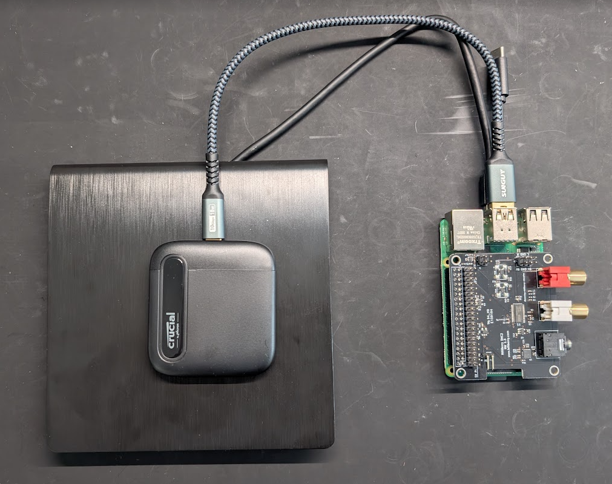
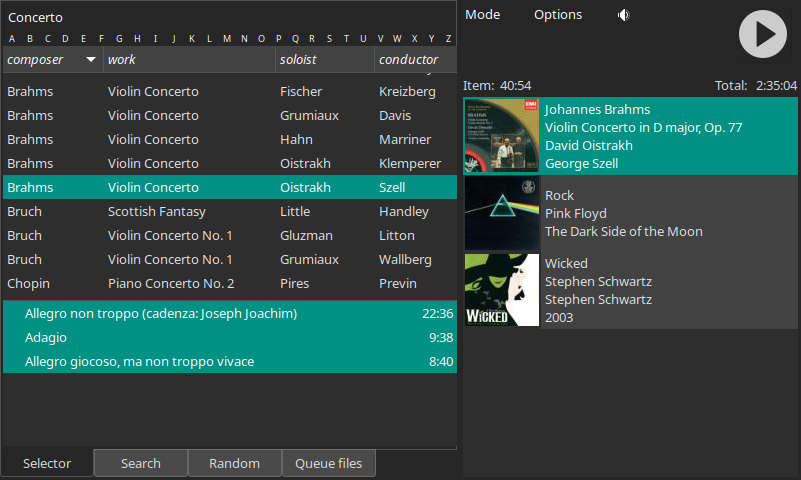
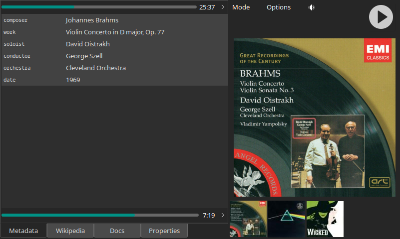
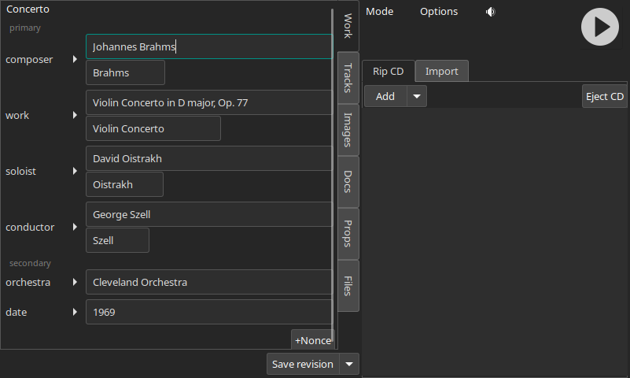
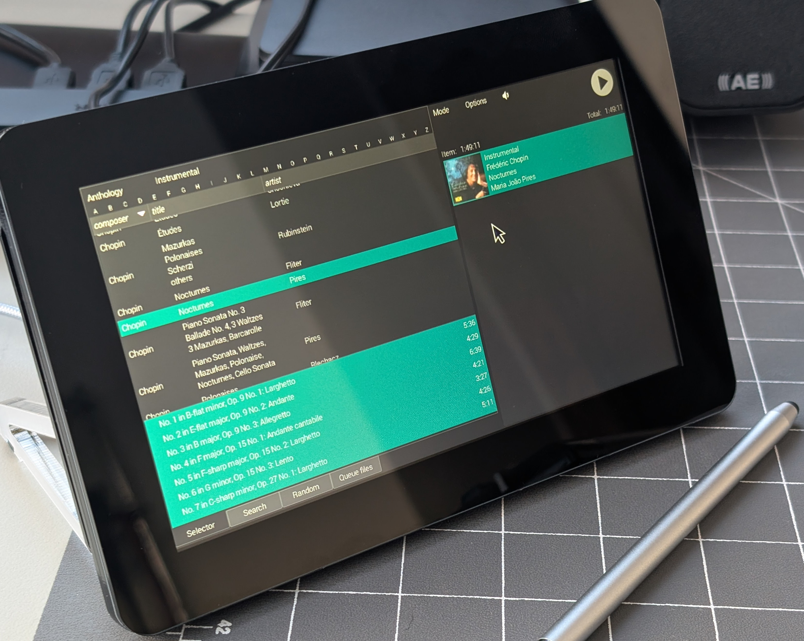
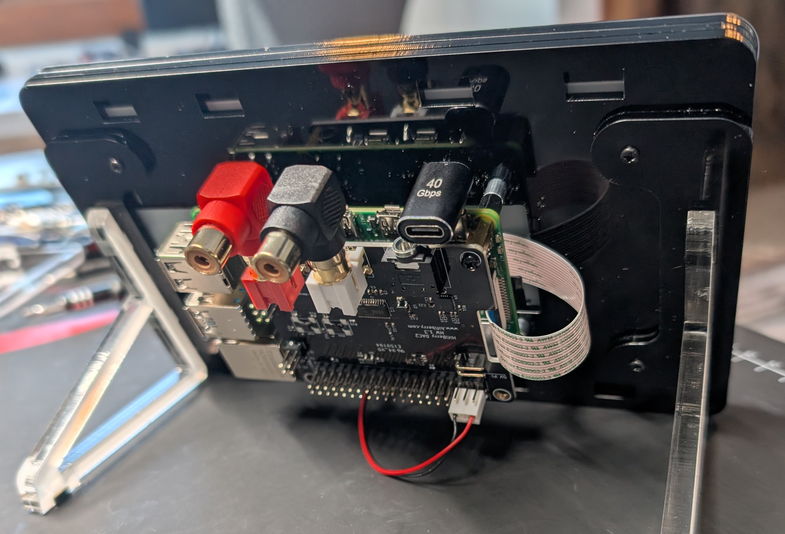

Audiophiles interested in a music server often spend over $10,000 for a product. The top choice of editors at a well-known audiophile magazine costs over $80,000. For that price, you might think that you would get not only a complete solution to the problem of serving music, but also a machine that vacuums the house and makes you coffee. You would be wrong on all counts. The core function of a music server is to play sound files, yet some audiophile music servers are sold without storage for the sound files. Many require that owners purchase a separate DAC. The core technical challenge in designing a music server is the software for the user interface, so you might expect manufacturers of exorbitant products to differentiate their products through innovative software. Again, you would be wrong. Some companies provide software that you can buy off the shelf (e.g., JRiver) and others use open-source software available to all at no charge. One company complains that developing and supporting their own software solution would be “a massive challenge”, so they use software from Roon, for which users must pay a recurring fee on top of the purchase price or render the product useless. No sane person would spend $80,000 for a car that lacked wheels, but apparently there are audiophiles willing to spend that much for a product that does not even provide all the functions of a music server without additional expenditures.

In this article, we present an economical system that does everything you expect from a music server and does it well, but you do not get an elaborately machined aluminum case. The core hardware is a Raspberry Pi 4B with a HiFiBerry DAC 2 HAT. The software is a free custom program that I wrote called “Wax”. Developing Wax *was* a massive challenge, but the software is the sine qua non of music servers so it is critical to get it right. Wax makes it easy to find desired recordings in your collection – especially if your collection includes classical music – and to present as much metadata as you want for each recording. In addition, it provides viewers for liner notes and Wikipedia so that you can dig deeper for information about the music you are listening to. Despite these virtues, you will not find this solution described in any audiophile publication because its parts cost is only $288 and it does not require a forklift to move it.

## Hardware

To start, let us consider the hardware. Here is an image of the system:



On the right, you can see the core of the system: a Raspberry Pi 4B with a HiFiBerry DAC2 Pro HAT. Bulk storage is provided by the 2TB SSD sitting on the CD drive. I recommend the Raspberry Pi 4B over the 5 because the latter requires a cooling fan. Fans are anathema for audio products because they make noise, although the tiny fan required for the Raspberry Pi 5 makes so little noise that you probably would not notice it in practice. (The fans in your $35,000 monoblock power amplifiers with their fancy machined aluminum cases probably make much more noise.) In any case, the Raspberry Pi 4B is sufficiently powerful to run Wax and it is cheaper. I have found that 4GB of memory is more than enough for Wax. In fact, I have never seen the memory requirements exceed 2GB, so you might even get away with the cheapest version – and save a whopping $10 to boot! You might consider substituting the HiFiBerry DAC2 HD ($109). It provides even better audio quality – lower THD and noise – for any golden ears out there.

Here is the parts list:

| Part | Price | 
|:--|--:|
| Raspberry Pi 4 Model B/4 GB| $55|
| HiFiBerry DAC2 Pro | $45 |
| Power supply | $8 |
| Crucial X6 2TB SSD | $110 |
| 2 GB SD card | $10 |
| CD drive | $30 |
| HiFiBerry Steel Case Pi4| $30 |
| **TOTAL** | **$288** |

The DAC2 Pro has phono connectors and a headphone jack for the audio outputs. Connect one of them to your preamp or powered loudspeakers. Use the two USB 2 ports for your keyboard and mouse. Connect your monitor to a micro HDMI port and your power supply to the USB-C port.

I run Wax on Raspberry Pi OS. You need to change the boot configuration to enable the DAC2 Pro HAT. Go to /boot/firmware and edit config.txt. You need to make three changes to the file:

1. Comment out the line dtparam=audio=on
2. Change the relevant line to dtoverlay=vc4-kms-v3d,noaudio (by appending “,noaudio”)
3. Add the line dtoverlay=hifiberry-dacplus somewhere in the file

It is also a good idea to create a file /etc/asound.conf with:

```
pcm.!default {
  type hw card 0
}
ctl.!default {
  type hw card 0
}
```

Reboot after making these changes. This information and much more is available at the [HiFiBerry website](https://www.hifiberry.com/docs/software/configuring-linux-3-18-x/).

## Software

Wax is different from other music software you might have seen or used in three important ways. First, the fundamental unit for entries in the catalog is a “work”, not a track. A work is usually a collection of tracks. In pop music, a work can be an album. For symphonic music, a work can be a single symphony, even when the tracks come from a CD with more than one symphony. For operas, a work can be a single opera even when the tracks come from multiple CDs. Music collectors usually think in terms of works, so a music manager that supports the concept makes operation more natural.

Another important difference is that genres are fundamental to the organization of a collection rather than a mere attribute of a track. Because the ideal way to catalog works varies by genre, Wax makes it possible to specify metadata keys on a per-genre basis. For example, symphonic works can be cataloged using the keys composer, work, conductor; shows can be cataloged with show, composer, lyricist, year; and pop with group, title. You decide what genres best characterize subsets of your collection, and for each genre you decide how many keys and what keys to assign to the genre.

Finally, Wax tightly integrates three functions: cataloging, selecting, and playing works. With Wax, you catalog a recording in Edit mode, then go to Select mode to put it in the play queue, and then go to Play mode to view all the metadata. You no longer have to bounce files back and forth between your player and tag editor. You can supplement or modify the metadata while listening to music, and any changes that you make to the metadata are immediately reflected in the display.

Here are views of Wax in each of its three modes. I selected a classical recording for this tour because classical music presents the greatest cataloging challenges. However, readers familiar with other programs will immediately recognize the virtues of Wax for recordings in other genres.

### Select mode



The Concerto genre has four keys, composer, work, soloist, and conductor. Notice how works by each composer are listed together and different versions of each work are listed together. The soloist in the selected recording appears on two recordings of this work, but even so it is easy to distinguish the recordings by looking at the conductor field. Wax obviates the need to click into other display modes to display details necessary to distinguish recordings. Wax also has incremental search and a mode for randomly selecting recordings. After selecting the desired recording, a panel appears with the tracks. Once you have selected the work and the desired tracks, you drag the selection to the play queue list on the right and then activate the play button.

### Play mode




In Play mode we see all the metadata associated with the work. Values that appeared in their short form in Select mode (e.g., “Brahms”) are presented here in their long form (“Johannes Brahms”). The Wikipedia page gets populated automatically with pages at Wikipedia related to the selection. The Docs page is for viewing liner notes.

### Edit mode




Edit mode is where you create new works or revise existing ones. The fields on the left are where you specify the work metadata. “Primary” keys have two value fields, one for the short form (Select mode) and the other for the long form (Play mode). Secondary metadata appear only in Play mode, so they have only a long form. The +Nonce button is for creating additional fields for metadata specific to one recording (for example, the soloists in an opera).

When you rip a CD, the panel on the right fills with metadata that Wax downloads from MusicBrainz. Wax automatically copies familiar names to the appropriate fields on the left, and it learns unfamiliar names so that it knows how to map them the next time they appear. Wax also suggests completions for partial entries so that typing “Moz” in the composer field, for example, will elicit suggestions including “Wolfgang Amadeus Mozart”. These and other features make it quick and easy to specify metadata for a work.

You can edit track titles on the Tracks page. In addition, you can add metadata specific to a track (for example, the name of a guest artist on a particular song) and form track groups. Track groups make it possible to highlight relationships among tracks – for example, all the tracks in an act of a musical.

The import tab presents controls for importing sound, image, or document files. When importing sound files, Wax extracts metadata – including embedded images – from the tags. As for rips, Wax displays the metadata in the panel on the right and automatically populates as much of the left panels as possible.

Once you have specified all the metadata you want, you click the “Save new” button to create a new work. When you save a new work, Wax tags the sound files with values derived from as much of its rich metadata as possible in case you ever want to listen to the sound files on some other platform.

## Installing Wax

Wax is free. To get a copy of the software, go to [github.com/jeffbarish](https://github.com/jeffbarish). There are four repositories. One is for Wax. wax-config is for a separate program called WaxConfig which is used for configuring Wax (e.g., creating genres) and for displaying statistics about your database (e.g., the number of works in each genre). The manual is in wax-manual. You can also view the manual on line at [wax-manual.readthedocs.io/en/latest/introduction.html](https://wax-manual.readthedocs.io/en/latest/introduction.html). Finally, there are two installer scripts in wax-install. The README in wax-install explains how to use the installers to install the software (basically, you just run the two “installer” commands).

Use [Raspberry Pi Connect](https://www.raspberrypi.com/documentation/services/connect.html) on the Raspberry Pi to control Wax remotely from any browser. I use a browser on my tablet to interact with Wax. This connection allows me to use Wax to make selections, activate play, control the volume, read liner notes, and more all from the convenience of my listening position.

## Packaging

There are several options for packaging your system. One is the inexpensive [HiFiBerry case](https://www.hifiberry.com/shop/cases/universal-steel-case-pi4/). It neatly houses the system pictured above.




A radically different approach takes advantage of the recently released Raspberry Pi Touch Display 2, a 7” 720x1280 touchscreen display. The dedicated touchscreen display avoids the need to connect a monitor, keyboard, and mouse. You can mount the two-card stack on the back of the display and use the [Pibow Frame](https://shop.pimoroni.com/products/pibow-frame-for-raspberry-pi-touch-display-2?variant=53514323001723) from Pimoroni to hold it. Here are some tips for achieving the best experience:

- Set the display to landscape mode: On the main menu, go to Preferences \| Screen Configuration \| Screen Orientation.

- Scale the display using the command

```
wlr-randr --output DSI-1 –scale=1.3
```

Put this command in ~/.config/labwc/autostart to activate the scaling automatically.

- Use WaxConfig to set the width of the right panel of Wax to 400.

- Operate Wax in fullscreen mode. To activate fullscreen mode, run Wax and then type Alt-space to open a menu for controlling the window. Select fullscreen. (Repeat that procedure to get out of fullscreen mode.)

- Continue to use the same Crucial USB SSD for your sound archive, or for an even more compact solution you could add [this](https://www.amazon.com/GeeekPi-Storage-Expansion-Raspberry-Included/dp/B0CBJYWKJ1/ref=pd_ybh_a_d_sccl_2/134-7902458-9411865?pd_rd_w=iJo7v&content-id=amzn1.sym.67f8cf21-ade4-4299-b433-69e404eeecf1&pf_rd_p=67f8cf21-ade4-4299-b433-69e404eeecf1&pf_rd_r=QZH798F96BDGTJC414B5&pd_rd_wg=loOET&pd_rd_r=19b8b67f-8161-448d-b2d0-ee349253767f&pd_rd_i=B0CBJYWKJ1&psc=1) storage expansion board and a suitable SSD to the stack. Then the only components separate from the three-card stack will be the power supply and the CD drive. You could leave the CD drive in a drawer and connect it only when you are ripping CDs.

- Mount the Raspberry Pi stack with the connectors facing up. The plugs (power and audio) will not fit otherwise even using 90° adapters like [this](https://www.amazon.com/gp/product/B0BNMCMYNF/ref=ppx_yo_dt_b_asin_title_o00_s01?ie=UTF8&th=1) and [this](https://www.amazon.com/gp/product/B075SGTVS8/ref=ppx_yo_dt_b_asin_title_o00_s01?ie=UTF8&th=1). Use the adapters instead to keep the cables hidden behind the touchscreen.

- Try using a [stylus](https://www.amazon.com/gp/product/B09CDCN7VS/ref=ppx_yo_dt_b_asin_title_o00_s00?ie=UTF8&th=1) if you find yourself fat-fingering because of the small size of the 7” touchscreen.

| Part | Price | 
|:--|--:|
| Previous total | $288 |
| Raspberry Pi Touch Display 2 | $60 |
| Pimoroni Pibow Frame (£15) | $19 |
| RCA 90° adapters | $2.50 |
| USB C 90° adapter | $3 |
| Touch screen stylus | $2.50 |
| **TOTAL** | **$375** |



## The Dream System

The system that I described in this tutorial is a feature-complete music server, unlike some commercial products costing 100x or more. Audio performance is competitive with those products and the software (he said modestly) is better. What else could anyone possibly want? Answer: my dream case. The standard HiFiBerry case can house the two-board stack of Raspberry Pi 4B and HiFiBerry DAC2 Pro. However, a dream case would accommodate one more HAT in the stack so that the SSD could be inside the case too. A turner board would also be nice so that all connectors are on the back panel. Anyone? If you were also inclined to design an elaborately machined aluminum case, what a takedown of the pretentious, audiophile snobs that would be!

